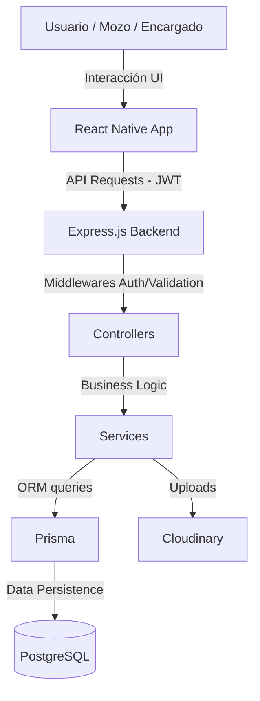

# Arquitectura del Sistema - TipPool

## 🔄 Flujo de Datos

## 🧠 Decisiones Técnicas

### ¿Por qué Prisma?
Elegimos Prisma como ORM por su **seguridad de tipos (Type Safety)** nativa con TypeScript. Facilita enormemente las migraciones de base de datos y la escritura de queries complejas sin sacrificar legibilidad. Además, el auto-completado de campos reduce drásticamente los errores en tiempo de ejecución.

### ¿Por qué React Native?
Permite el desarrollo **multiplataforma (iOS y Android)** con una única base de código. Para un entorno de hostelería, la portabilidad es clave; los repartos se gestionan mejor desde dispositivos móviles en el lugar de trabajo.

## 🔒 Seguridad

### Autenticación y Autorización
- **JWT (JSON Web Token)**: Implementado para sesiones seguras con una expiración de 7 días, permitiendo que el personal no tenga que loguearse constantemente durante su semana laboral.
- **Roles y Permisos**: Middleware especializado que valida si el usuario tiene el rango de `ENCARGADO` antes de permitir operaciones críticas (crear personal, cerrar repartos).

### Protección de Datos
- **Hasheo de Contraseñas**: Se utiliza `bcrypt` con un factor de trabajo de 10 para asegurar que las contraseñas nunca se almacenen en texto plano.
- **Validación de Inputs**:
  - **Backend**: Esquemas de validación centralizados para asegurar la integridad de los datos antes de tocar la base de datos.
  - **Frontend**: Feedback inmediato al usuario mediante `react-hook-form` y `zod` para prevenir errores de carga.
- **Gestión de Secretos**: Todas las credenciales externas (Cloudinary, DB URL, JWT Secret) se gestionan mediante variables de entorno, nunca en el código fuente.
